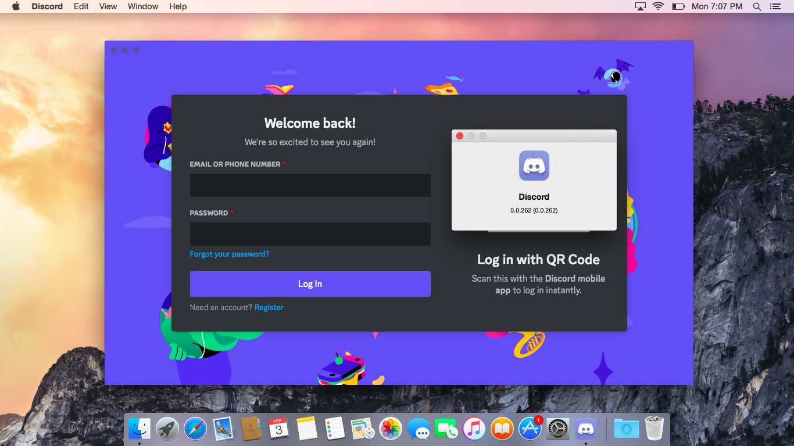
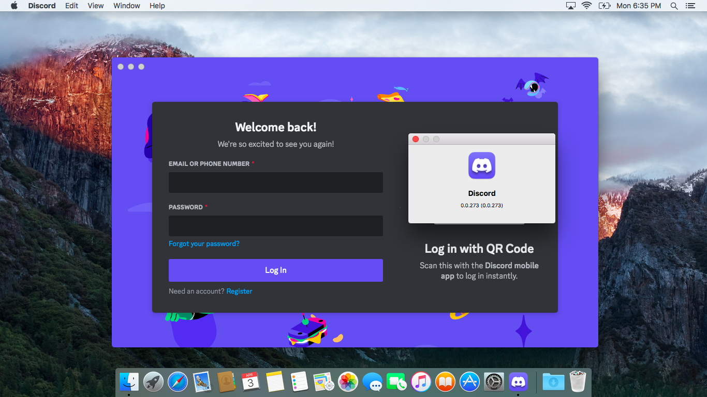
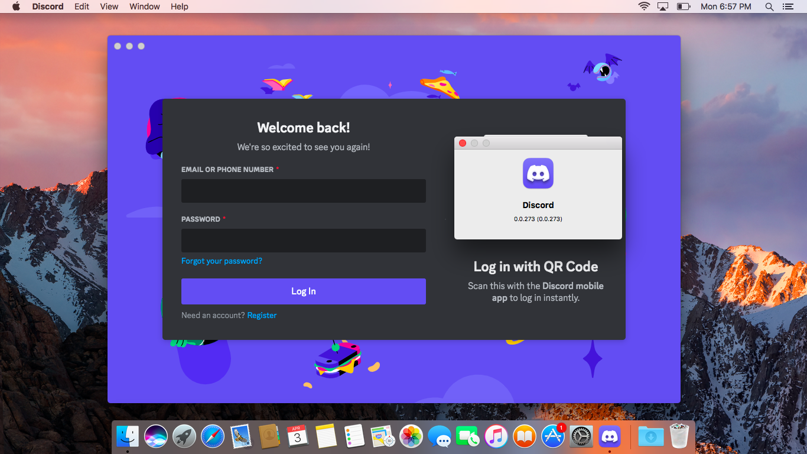

<h1>Discord Legacy</h1>

Restores Discord Desktop Client functionality on OS X 10.9, OS X 10.10, OS X 10.11, and macOS 10.12
* [ ] 10.8 support
* [x] 10.9 support via Client 0.0.255
* [x] 10.10 support via Client 0.0.262
* [x] 10.11 support via Client 0.0.273
* [x] 10.12 support via Client 0.0.273
* [x] Custom version support
* [x] Embed Node.js and dependencies
* [x] Distribute build with 10.9+ compatibility
* [ ] Windows support - Windows 7, Windows 8, and Windows 8.1 (Futureproofing)

## Screenshots
| OS X Yosemite | OS X El Capitan | macOS Sierra |
| ------------- | --------------- | ------------ |
|  |  |  |

## Downloads
[Download latest patcher release from GitHub](https://github.com/Jazzzny/Discord-Legacy-Patcher/releases/latest
)
